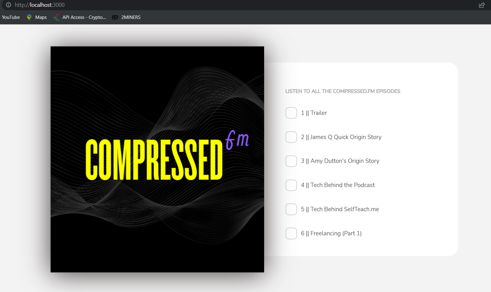
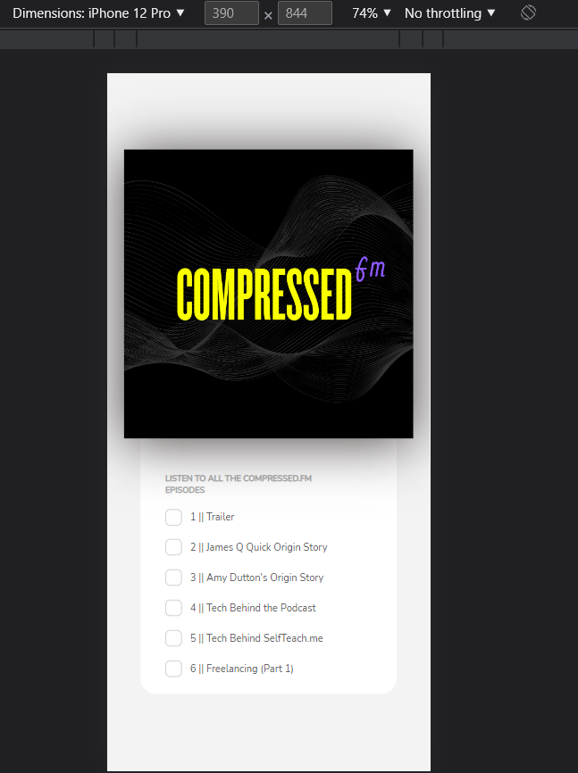

## Make It Real - Profile Card Component

This is a solution to the final project of the Make It Real Onboarding program.

## Table of contents

- [Overview](#overview)
  - [The challenge](#the-challenge)
  - [Solution Screenshot](#solution-screenshot)
- [My process](#my-process)
  - [Built with](#built-with)
  - [What I learned](#what-i-learned)
  - [Continued development](#continued-development)
  - [Useful resources](#useful-resources)
- [Author](#author)
- [Acknowledgments](#acknowledgments)

## Overview

### The challenge

Users should be able to:

- See the list of podcast episodes
- Checking off an episode will mark the episode as watched and will strike-through the title

### Solution Screenshot




## My process

### Built with

- React / React hooks
- Handle Click events
- Flexbox
- Semantic HTML5
- keyframes

### What I learned

In this project it was learned how to bluid a React layout using a <useState()> hook for setting Array/Object's properties.

```js
const [podcastItem, setPodcastItem] = useState([
  {
    key: "1",
    text: "Trailer",
    box: uncheckedBox,
    style: "PodcastListItemUnchecked",
  },
  /*... Other objects ...*/
  {
    key: "6",
    text: "Freelancing (Part 1)",
    box: uncheckedBox,
    style: "PodcastListItemUnchecked",
  },
]);
```

This is how to Set Array/Objects's properties handling Click/Unclick events

```js
{
  podcastItem.map((item, index) => {
    return (
      <ul key={item.key} className={item.style}>
        </img>
        <p onClick={handleClick(index)} className="PodcastListItemText">
          {item.key} || {item.text}
        </p>
      </ul>
    );
  });
}
```

```js
const handleClick = (index) => () => {
  let newPodcastItem = [...podcastItem];
  if (newPodcastItem[index].box === uncheckedBox) {
    newPodcastItem[index].box = checkedBox;
    newPodcastItem[index].style = "PodcastListItemChecked";
  }
  setPodcastItem(newPodcastItem);
};
```

```js
const handleUnClick = (index) => () => {
  let newPodcastItem = [...podcastItem];
  if (newPodcastItem[index].box === checkedBox) {
    newPodcastItem[index].box = uncheckedBox;
    newPodcastItem[index].style = "PodcastListItemUnchecked";
  }
  setPodcastItem(newPodcastItem);
};
```

This is how to animate a Layout using Keyframes in CSS

```CSS
.PodcastImage {
  animation-duration: 2s;
  animation-name: SlideToLeft;
  z-index: 2;
}
```

```CSS
@keyframes SlideToLeft {
  from {
    transform: translateX(250px);
  }
  to {
    transform: translateX(0px);
  }
}
```

### Continued development

It will be nice to continue developing the layout in order to access a real podcast episode from the webpage.

### Useful resources

- [useState resourse](https://reactjs.org/docs/hooks-state.html) - This helped me figuring out how to use this property.
- [Handle Click functions](https://upmostly.com/tutorials/react-onclick-event-handling-with-examples) - This resourse helped figuring out how handle click events.
- [Keyframes resource](https://www.w3schools.com/cssref/css3_pr_animation-keyframes.php#:~:text=Definition%20and%20Usage,of%20CSS%20styles%20many%20times.) - This resourse helped figuring out how to use Keyframes.

## Author

- Github - [Juan Velasco](https://github.com/juandiegovelsol)

## Acknowledgments

Kudos to our friends and mentors: Sergio Jaramilo and Daniel Espitia.
